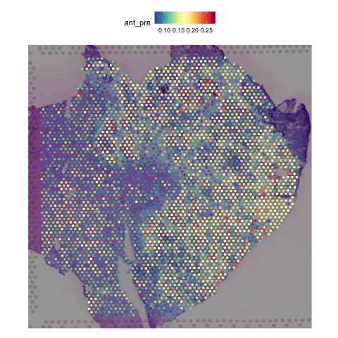

# PSAA: A physics informed neural network approach to quantify antigen presentation activities at single cell level using omics data
**PSAA** is an R package that offers a detailed, stepwise quantification of MHC pathway activity, enabling predictions of gene-specific impacts and their downstream effects on immune interactions. **PSAA** works with diverse omics data types, such as bulk data, single cell RNA-seq data, spatial transcriptomic data and proteomics data.

**PSAA** built upon [scFEA](https://github.com/changwn/scFEA) and [scFEA-mpo](https://github.com/ptdang1001/scFEA/tree/main) for robust metabolic flux estimation.

Briefly, **PSAA** takes as input: 1) a gene expression matrix (or protein expression matrix) stored in a Seurat object and 2) a MHC-I or MHC-II antigen presentation pathway, which has already been reconstructed in this paper, see details from [Pathway Construction](https://github.com/JiaW6122/PSAA/blob/main/supplementary%20files/Pathway_Construction.md). The reconstructed pathways were represented as directed factor graphs where each intermediate state of antigen or MHC complexes is a factor and each reaction step is a variable. **PSAA** can further estimate the activity level of each reaction step using expression changes of the genes or proteins involved in the steps.

# Preparation
Install **PSAA** from GitHub:
```R
library(remotes)
remotes::install_github("JiaW6122/PSAA")
```
Set up the environment:
```R
library(Seurat)
library(ggplot2)
library(patchwork)
library(dplyr)
library(reticulate)
```

Make sure to install all the requirements of [scFEA](https://github.com/changwn/scFEA). In R, you can Use Conda to create a Python environment for scFEA: 
```R
# Install Miniconda if not already installed
install_miniconda()
# Create a Conda environment
conda_create("scFEA_env")
```
Install Python Dependencies:
```R
# Install PyTorch
conda_install("scFEA_env", packages = c("pytorch", "torchvision", "torchaudio"), channel = "pytorch")

# Install magic-impute
conda_install("scFEA_env", packages = "pip")
py_install("magic-impute", envname = "scFEA_env")
conda_install("scFEA_env", packages = c("numpy",  "matplotlib"))
conda_install(envname = "scFEA_env", packages = "pandas=1.3.5")
```
Specify the Python Environment in R:
```R
use_condaenv("scFEA_env", required = TRUE)
py_config()  # Verify the environment and Python path
```

# Tutorials 

**PSAA** can take the input of diverse omics data types, such as bulk data, single cell RNA-seq data, spatial transcriptomic data and proteomics data. The following demos illustrate the main functionalities of the PSAA package for antigen presentation prediction and further analysis. We show some examples on public data, but you should be able to adapt them to your own datasets.

## Spatial transcriptomics data


Download the sample data from: https://drive.google.com/file/d/1fKSEY8GlX2w2bRqMCO_XIe7lWQ76kusO/view?usp=share_link

Load demo dataset:
```R
data <- readRDS("your_path/GSE206552_meta1.rds")
```

Run PSAA to predict sample-wise antigen presentation levels through MHC calss I antigen presentation pathway:
```R
library(PSAA)
data <- PSAA::psaa(data, "mhc1", "GSE206552_meta1")
```

Visualize the predicted antigen presentation levels in spatial transcriptomics data:
```R
PSAA::plot_levels(data, "mhc1", "pre")
```


