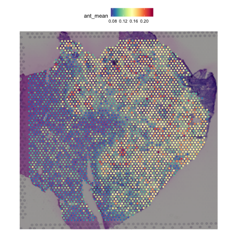
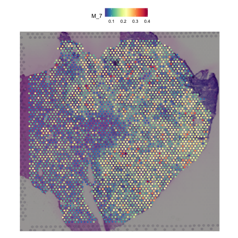
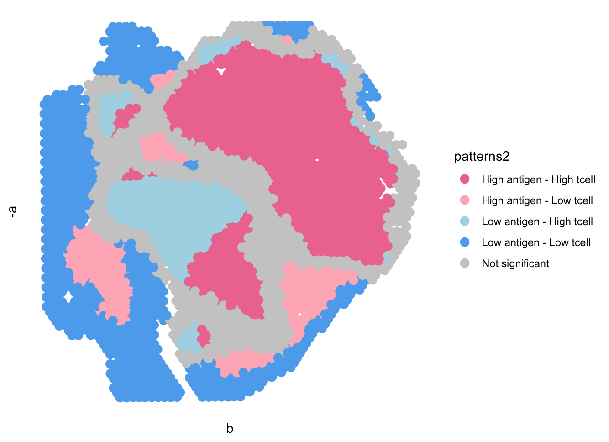

# PSAA: A physics informed neural network approach to quantify antigen presentation activities at single cell level using omics data

**PSAA** is an R package that offers a detailed, stepwise quantification of MHC pathway activity, enabling predictions of gene-specific impacts and their downstream effects on immune interactions. **PSAA** works with diverse omics data types, such as bulk data, single cell RNA-seq data, spatial transcriptomic data and proteomics data.

**PSAA** built upon [scFEA](https://github.com/changwn/scFEA) and [MPOSNN](https://github.com/ptdang1001/MPOSNN) for robust metabolic flux estimation.

Briefly, **PSAA** takes as input: 1) a gene expression matrix (or protein expression matrix) stored in a Seurat object and 2) a MHC-I or MHC-II antigen presentation pathway, which has already been reconstructed in this paper, see details from [Pathway Construction](https://github.com/JiaW6122/PSAA/blob/main/supplementary%20files/Pathway_Construction.md). The reconstructed pathways were represented as directed factor graphs where each intermediate state of antigen or MHC complexes is a factor and each reaction step is a variable. **PSAA** can further estimate the activity level of each reaction step using expression changes of the genes or proteins involved in the steps.

# Preparation

Install **PSAA** from GitHub:

``` r
library(remotes)
remotes::install_github("JiaW6122/PSAA")
```

Set up the environment:

``` r
library(Seurat)
library(ggplot2)
library(patchwork)
library(magrittr)
library(stringr)
library(dplyr)
library(reticulate)
library(philentropy)
```

Make sure to install all the requirements of [scFEA](https://github.com/changwn/scFEA).

Create Conda Environment and Install Python Dependencies:

```         
conda create -n myenv python=3.11
conda activate myenv
pip install magic-impute numpy==1.25.2 pandas==1.5 torch tqdm
```

Specify the Python Environment in R:

``` r
use_condaenv("myenv", conda = "~/opt/anaconda3/bin/conda", required = TRUE)
py_config()  # Verify the environment and Python path
```

# Tutorials

**PSAA** can take the input of diverse omics data types, such as bulk data, single cell RNA-seq data, spatial transcriptomic data and proteomics data. The following demos illustrate the main functionalities of the PSAA package for antigen presentation prediction and further analysis. We show some examples on public data, but you should be able to adapt them to your own datasets.

## Bulk data

Downloads and preprocesses the GSE111581 bulk expression dataset, constructs a Seurat object:

``` r
# Load required libraries
library(GEOquery)
library(Seurat)

# Download and parse GEO dataset
gse <- getGEO("GSE111581", GSEMatrix = TRUE)[[1]]

# Extract expression matrix, sample metadata, and annotation
expr  <- exprs(gse)           # Expression matrix
pheno <- pData(gse)           # Sample-level metadata
ann   <- fData(gse)           # Probe-level annotation


# Keep only rows with non-empty gene symbols (ORF column)
ann_clean <- subset(ann, ORF != "" & !is.na(ORF))

# Match annotation to expression matrix
expr <- expr[rownames(expr) %in% ann_clean$ID, ]
rownames(expr) <- ann_clean$ORF[ match(rownames(expr), ann_clean$ID) ]

# Drop entries without a gene symbol
expr <- expr[ !is.na(rownames(expr)) & rownames(expr) != "", ]

# Remove rows (genes) with any missing values
expr_noNA <- expr[ rowSums(is.na(expr)) == 0, ]

# Ensure unique gene names
rownames(expr_noNA) <- make.unique(rownames(expr_noNA))

# Create Seurat object from cleaned data
data <- CreateSeuratObject(counts = expr_noNA, meta.data = pheno)

# Normalize the expression data
data <- NormalizeData(data)
```

Applies the PSAA model to estimate antigen presentation activity for the MHC class II pathway:

``` r
data <- PSAA::psaa(data, pathway = "mhc2", sample_name = "GSE111581")
```

Results are saved in:

`data$ant_pre`: antigen presentation levels (cell surface) per sample

`data$ant_mean`: average antigen presentation levels per sample

## Spatial transcriptomics data

Download the example data from: <https://drive.google.com/file/d/1fKSEY8GlX2w2bRqMCO_XIe7lWQ76kusO/view?usp=share_link>

Load demo dataset:

``` r
data <- readRDS("your_path/GSE206552_meta1.rds")
```

### Run PSAA to predict sample-wise antigen presentation levels

Here we show how to use PSAA to predict MHC calss I antigen presentation levels:

``` r
library(PSAA)
data <- PSAA::psaa(data, pathway = "mhc1", sample_name = "GSE206552_meta1")
```

If you want to predict sample-wise antigen presentation levels through MHC calss II antigen presentation pathway, use parameter `pathway = "mhc2"`.

Visualize the predicted antigen presentation levels in spatial transcriptomics data:

``` r
PSAA::plot_levels(data, pathway = "mhc1", sample_name = "GSE206552_meta1", mode = "pre")
```

You can also visualize the average antigen presentation levels through the whole pathway, using parameter `mode = "avg"`. Or visualize the average antigen presentation levels of a sepcific module ("M_7") in the selected antigen presentation pathway, using parameter `mode = "M_7"`

<p align="center">

  

</p>

### Spatial segmentation upon varied dependency between predicted antigen presentation and T cell infiltration

To evaluate the spatial dependency between predicted antigen presentation and T cell infiltrations and identify the spatial regions show varied dependencies, PSAA computes local bivariate Moran’s I correlation and segment the regions of significant dependencies into four regions – “High antigen, High T cell”, “High antigen, Low T cell”, “Low antigen, High T cell” and “Low antigen, Low T cell”.

``` r
PSAA::spatial_seg(data, pathway = "mhc1", sample_name = "GSE206552_meta1")
```

<p align="center">



</p>
